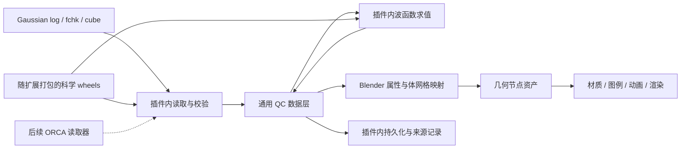

# QCBlender 首版设计

更新：2026-09-22。状态：0.0.1 开发验收候选已实现；支持边界和实际证据见 [验收记录](VALIDATION.md)，操作见 [用户指南](USER_GUIDE.md)。本文件保留首版目标，未验收项不因列入设计而成为已支持功能。

**QCBlender 是单个 Blender 扩展，在插件内把 Gaussian 输出转成通用量子化学数据，再用可编辑几何节点展示电子结构、分子性质和振动。首版内置波函数求值，选择轨道即可生成空间场。**

用户已确定：不要求安装外部 Python 包、环境或 ChemBlender；`cbq_core` 可作源码与思想参考。必要科学依赖由开发者构建/收集为 wheels，随扩展离线分发。首发验收 Windows x64 + Blender 5.1.1；数值范围为非周期分子的实值 HF/DFT，含开壳层与常见基组。优化/IRC、差分分析、WFN/WFX 和高级分析分期交付，后续支持 ORCA。

详细契约见 [数据模型](specs/qc-data-contract.md)、[几何节点](specs/geometry-nodes.md)、[Gaussian 能量](research/gaussian-energy-semantics.md)、[扩展打包](research/blender-extension-packaging.md)。

## 1. 首版交付与后续路线

| ID | 首版用户任务 | 完成结果 |
| --- | --- | --- |
| V01 | 导入 Gaussian 计算结果 | Log/FCHK/Cube 转成内部数据；结构、计算条件、来源、单位及缺失能力明确 |
| V02 | 选择轨道并成图 | 从 FCHK 基组与 MO 计算指定轨道；HOMO/LUMO、自旋/编号、能级/占据显示；正负面用节点控制 |
| V03 | 电子密度和自旋密度 | 从支持的 HF/DFT 波函数求值或读取 Cube；总/Alpha/Beta/自旋与理论层次标注正确 |
| V04 | ESP 映射与空间切片 | 密度定义表面、ESP 定义颜色；固定色标、可编辑阈值/切片；采样域外有诊断 |
| V05 | 电荷、偶极与结构 | 球棍、原子选择、至少 Mulliken 电荷、物理偶极矢量、测量/标注；未知性质不补零 |
| V06 | 真实振动与 IR 联动 | 频率/IR 棒状数据选择模式，加载真实位移；节点调振幅/相位/箭头；虚频标识保留 |
| V07 | 保存与成图 | 冷重开保持科学数据、节点、材质与色标；配套数据迁移和图像/动画导出可用 |
| V08 | 单插件安装体验 | 扩展包包含所需解析/求值依赖；干净 Blender 中离线安装，无系统 Python 配置步骤 |

V01–V08 都是首版完成条件。已有 Cube 显示可以作为开发里程碑，不能替代用户要求的 V02 内置求值。

后续分期：优化/扫描/IRC 与能量曲线；差分分析与比较；WFN/WFX/Molden；ORCA 的日志/官方导出；相关方法密度、多态波函数、NTO、NCI/RDG、ELF/LOL、QTAIM、张量和完整模拟光谱。保留长期目标，不将它们计入首版已交付功能。

VMD/VESTA 替代效果按 V02–V07 的具体输入、物理阈值、色标、坐标与输出逐项比较。首版范围不包含通用分子动力学分析、空间群/衍射/晶体形貌操作。

## 2. 输入文件与能力

| 输入 | 首版用途 | 必需诊断 |
| --- | --- | --- |
| Gaussian `.log/.out` | 计算段、结构、条件、方法特定能量、原子电荷、偶极、振动/IR | 按内容判别；Link1/截断/异常终止；能量角色与几何/态明确；轨迹播放器后续 |
| `.fchk/.fch` | 原子/基组/MO/占据/能量和可用密度矩阵；内置求值主入口 | AO 顺序、归一化、SP/球谐/笛卡尔、通道、ECP、线性相关删除等能力检测 |
| `.cube/.cub` | 已计算的轨道、密度、自旋、ESP 等场 | 单/多 MO、数据交错、斜轴、单位、来源语义、损坏数据；未知场保留未知 |
| `.chk` | 提供 Gaussian `formchk` 导出指导；已有工具者可选配置转换 | 二进制不按文本读；Gaussian 程序不随包分发，已有 FCHK/Cube 路线无需该程序 |
| `.gjf/.com` | 配套输入元数据可作辅助资料 | 不将输入文件计为输出能力；Z-matrix/非默认单位另行覆盖 |
| `.wfn/.wfx/.rwf` 等 | 明确识别和说明，按路线分期 | WFN/WFX 后续接入；RWF 需适用导出流程，不能假装取得所有状态 |

真实样本优先 Gaussian 16 和 09，逐份记录 revision、方法和任务类型。支持范围是“格式 × 内容 × 科学后端能力 × 验收样本”的交集，不能写成“支持所有 Gaussian 文件”。格式证据见 [输入研究](research/gaussian-inputs.md)。

多文件只有在计算/构型、原子顺序与坐标系匹配后才关联，同名只提示候选。Cube 可独立显示已知场；缺 FCHK 时轨道能量/占据显示未知。FCHK 缺基组/MO 时给具体缺项，不生成零场。

## 3. 单扩展内部架构

计算逻辑和 Blender 接口分层服务正确性与测试；安装交付仍为一个扩展。

| 模块 | 责任 | 最小接口 |
| --- | --- | --- |
| `io` | 格式、原始记录、计算段、单位、来源；封装成熟读取器 | `read_source(path)` |
| `model` | 结构/态/能量/轨道/场/模式及校验 | 验证过的数据对象，无 `bpy` |
| `compute` | AO/MO、电子/自旋密度、ESP 求值及能力检查 | `evaluate_field(request)` |
| `storage` | manifest/数组、摘要、科学与显示缓存 | 保存/加载/重定位 |
| `blender` | 属性/VDB、节点资产、侧栏、图例和渲染 | `build_view(data_id, recipe)` |
| `tasks` | 长任务、取消、进度、结果校验与主线程接入 | 本地请求与结果 |

上表按职责描述：当前 `readers.py` / `gaussian_log.py` / `cube.py` 实现读取，`data.py` 实现模型与数组存储，`evaluate.py` 实现求值，`project.py` 实现不可变数据复制与工程归档，`worker.py` / `blender/jobs.py` 实现后台任务，`blender/` 实现视图和操作。无需抽象基类或通用注册框架。借鉴 `cbq_core` 的单位、网格、来源、校验和缓存思路；当前不以安装 `chemblender-prepare` 为前提。

Python 后端在选定网格求值；几何节点针对已载入场提面、采样和着色。调等值/材质不重跑求值；改变轨道/自旋/理论层次、网格范围/间距时，通过明确操作更新场和显示引用。

首版数值范围由用户确认：非周期分子、实值 HF/DFT，含开壳层与常见基组。更广方法的已打印能量仍读取并标识，能量解析成功不证明其密度也可求值。ESP 保留 Cube 与内置完整密度求值两条路线；有效核电荷/密度定义/积分条件不足时明确不可用，不用原子点电荷模型替代。

### 后台执行

文件解析与数值任务由**当前 Blender 自身可执行文件**启动受控无界面子进程，加载同一个扩展及其 wheels；`bpy` 视图接入在主线程，无需用户另装 Python。

子进程接收受约束 JSON 请求/数组路径，在任务目录产出结果。主进程校验完整性、版本、任务 ID 和取消状态后接入。启动使用参数列表，任务请求不含待执行 Python 文本。扩展启用、wheel 路径初始化和离线冷启动在 M0 实测；不把本机已能 import 当成发行包通过。

UI 定时读取进度；取消只停止本任务记录的进程，不接入未完成结果。任务目录和错误日志保留供诊断，当前不自动回收磁盘缓存。已有成功数据不受影响。

## 4. 方法特定能量

sobereva 文章导出的需求是：**保留能量的科学身份，显示选定方法对应的目标值。** 不能统一取最后一条 SCF 或用 archive `HF=` 标签决定理论方法。

| 方法/任务 | 目标候选 | 必须区分 |
| --- | --- | --- |
| HF、常规 DFT | 相应步骤收敛的 `SCF Done` | archive `HF=` 只是标签，不是方法证明 |
| MP2 | MP2 总能量 | 参考 SCF、相关校正与目标总能量 |
| 双杂化 DFT | 对应泛函最终总能量 | SCF 部分不是完整结果，archive 别名须核实 |
| CCSD(T) | 完成的 CCSD(T) 总能量 | 中间 MP2/CCSD/迭代值保留各自角色 |
| CASSCF | 对应 state 的能量 | 多态不能压成一个值 |
| TD/CIS | 明确 root 的总能量或可追溯派生值 | 基态、激发能、激发态总能量 |
| 半经验/MM | 该方法定义的能量 | 不默认标成同一意义的从头算电子总能量 |
| G4/CBS 等 | 特定摘要和温度/校正定义 | 0 K/有限温内能、ZPE、焓、自由能、电子能量 |

详细字段、选择规则和证据等级见 [能量研究](research/gaussian-energy-semantics.md)。无真实样例的规则只作设计候选，不直接标为支持；方法特定原始值应保留，不强行归入已实现规则。

界面有“目标方法能量”及可展开的“参考/中间/校正/热力学记录”，显示方法、步/态、单位、收敛与源位置。不能识别唯一目标时列出候选和诊断。后续差值操作需检查量的种类、方法/基组、态、温压和参考。

## 5. 节点与工作流

节点遵循“数据 → 选择 → 样式 → 采样/颜色 → 组合”。[节点契约](specs/geometry-nodes.md) 定义实际接口类型、属性域、科学/显示参数及可观察行为。

当前按视图创建可编辑节点组：原子选择/球棍/振动合并在原子组中，双相提面、采样/色标、切片、偶极和 IR 使用对应原生节点。配方职责和 socket 契约见节点文档；不要求每项职责都有一个单独命名的公共节点组。

用户依次导入与校验文件、选择物理量、生成未缓存场、编辑节点配方、保存工程并导出。侧栏快捷控件与节点共享同一状态；节点求值不读取 FCHK、不启动 Gaussian。IR 模式选择更新位移属性，连续动画由节点完成。

默认保留表面形状：关闭几何平滑、删碎片、重网格与自适应简化；法线平滑仅改着色。场域外采样不假装为零，静态轨道不随振动变形成虚构的时变波函数。

## 6. 依赖打包

优先 Blender 自带标准库、NumPy、OpenVDB；成熟 QC 格式使用随扩展的库，所需 `cbq_core` 思路/代码在插件内实现或审查后移植。

| 能力 | 候选 | 当前状态 |
| --- | --- | --- |
| 显示 | 自带 NumPy/OpenVDB + 原生 `bpy` | 本机 5.1.1 合成场路线通过 |
| Log/性质 | cclib 1.8.1 + 方法特定能量适配 | 实际 HF/DFT、MP2、CCSD(T)、DSDPBEP86、TD/IR/Link1 样本验证 |
| FCHK | IOData 1.0.1 | 固定 wheel；闭壳层、UHF/ROHF、球谐/笛卡尔、nMO<nAO 验证 |
| AO/MO/密度/ESP | 固定 GBasis 源码的纯 Python wheel | 使用宿主 NumPy，数值模块不改写；独立 Cubegen/Fortran 参考通过 |
| Cube | 有边界的文本适配器 | 多 dataset/斜轴/符号/未知量与坏输入通过检查 |
| 二进制转换 | 已有 Gaussian 工具者可选 formchk | 不属于插件正常安装必需依赖 |

固定候选、官方来源及风险见 [打包研究](research/blender-extension-packaging.md)。不降级 Blender NumPy 来迁就依赖；开发分支的兼容声明也不等于已有可发布 Windows wheel。

开发者固定源码/版本、构建 wheels、收集许可证/哈希、生成 `windows-x64` 扩展包并离线验收。运行时不执行 pip/uv、不下载缺包、不寻找系统 Python。后端缺失是发行包不合格，不能要求用户自行补环境。Linux/macOS 后续逐平台发布。

长任务复用 Blender 自带运行时，但应检查其它扩展使用的共享 wheel 区域及版本冲突；纯 Python wheel 也不自动保证依赖元数据兼容。

## 7. 保存与通用格式

插件内版本化 JSON manifest + NumPy 数组保存科学真值，VDB 为可重建缓存。内部格式标识 `qcblender.project`，不宣称是行业标准或直接兼容 CBQ。

默认建议 `.blend + <name>.qcdata/` 配套并提供打包工程操作；安装仍只有一个扩展。来源、schema、单位、坐标、hash 与派生关系见 [数据契约](specs/qc-data-contract.md)。全数据内嵌 `.blend` 若成为要求，需要额外测大场体积与内存。

## 8. 开发路线

| 阶段 | 交付 | 通过条件 |
| --- | --- | --- |
| M0 科学/打包可行性 | 兼容 wheels、内置求值、Blender 后台任务、固定真实样例 | 干净 Blender 离线载入所需包，单轨道与 Gaussian 参考一致 |
| M1 数据和已有场 | Log/FCHK/Cube → 内部数据，结构与 signed Cube，来源/单位 | V01、V05 基础，多文件配准/坏输入、多 dataset |
| M2 内置求值 | 轨道选择、MO/密度/自旋/ESP、缓存、取消与进度 | V02–V04 求值路线，独立参考和数值收敛 |
| M3 节点配方 | 选择/材质、双相、双场、切片/色标、偶极 | 数值采样、阈值、图例与真实显示一致 |
| M4 振动与能量 | 模式/位移/虚频/IR 联动、方法特定能量 | V06，真实频率输出和已支持能量规则 |
| M5 发布验收 | 离线安装、保存/迁移/恢复、渲染与文档 | V01–V08 均通过，真实用户工作流独立确认 |
| 后续 | 优化/IRC、差分、WFN/WFX、高级分析和 ORCA | 各自输入/数值/节点/打包证据 |

M0 先验证最高风险。数据解析、数值正确、Blender 行为、视觉和用户认可分开记录；任何单项成功都不代替其它项。

## 9. 验收矩阵

| Gate | 必须验证 |
| --- | --- |
| 文件/来源 | G16/G09 正常/异常/截断/Link1，FCHK 完整/缺字段，多 dataset/斜轴 Cube，原始位置 |
| 科学 | AO ordering/normalization、SP/球谐/笛卡尔、开壳层；MO 相位等价，电子数/网格收敛，ESP 核电荷 |
| 能量 | 已声明规则的实际输出；参考/目标/热校正/电子态/构型绑定，无简单数组 zip |
| 节点 | 主要 socket 改变对应结果；坐标/有效域/阈值/色标/模式/稳定数据身份 |
| 安装/生命周期 | 离线干净 profile、多扩展共存、取消/异常、重开/移动、中文和空格路径 |
| 视觉/科研 | 对照 VMD/VESTA 同一物理输入；科学图注一致，人工认可与数值证据分别记录 |
| 性能 | 64³/128³/256³，硬件/冷暖耗时/内存/取消；轨道按需缓存 |

MO 对比允许整体反号，简并轨道按对应子空间处理；逐点误差容差来自参考精度。密度积分用正确体元并做范围/步长收敛；ESP 避开核奇点并说明域。256³ 单个 float64 场约 128 MiB，峰值预算还需包括副本、VDB 与表面。

## 10. 当前证据

**Passed**：Gaussian Log/FCHK/Cube 读取及 19 项科学回归；MO/密度/ESP 独立数值参考；开壳层和常见基组不变量；网格收敛与带电远场；全新 Blender 配置离线安装、后台运行与取消；原生节点、双场图例、切片、振动/IR；配套工程保存/迁移/缓存恢复。具体精度、脚本及当前候选证据见 [验收记录](VALIDATION.md)。

**Not Run**：用户独立复做认可、VMD/VESTA 同场景人工视觉比较、其他平台安装。许可证材料复核和对外发布不由本地数值/安装检查替代。

资料来源见 [阅读记录](research/source-review.md)；架构取舍见 [单扩展 ADR](adr/0001-self-contained-extension.md)。包版本/源码在锁文件中固定，开发构建步骤见 [构建说明](DEVELOPMENT.md)。
