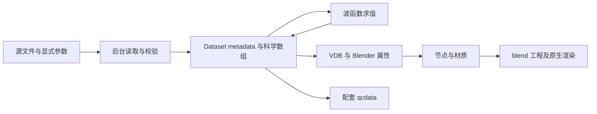

# QCBlender 架构与职责

QCBlender 作为单个 Blender 扩展读取已有量子化学结果、对支持的波函数求值，并以可编辑几何节点显示。科学数据与 Blender 显示分层；必要科学 wheels 随扩展分发，运行时使用同一 Blender 的后台进程。架构决定见 [单扩展 ADR](adr/0001-self-contained-extension.md)。

当前输入、数值方法和验证边界以 [VALIDATION](VALIDATION.md) 为准。Gaussian 优化日志浏览与外部 IRC FCHK 序列是两条已实现路径；前者限制任务类型，后者要求显式步序。用户操作见 [用户指南](USER_GUIDE.md) 和 [外部结果导入](EXTERNAL_ANALYSIS_IMPORT.md)。

## 代码与数据流

以下路径相对于 `qcblender/`，均为现有模块。

| 模块 | 实际职责与接口 |
| --- | --- |
| `readers.py`、`gaussian_log.py`、`cube.py` | `read_source(path, job_index=0)` 分派读取；IOData 读取 FCHK，cclib 与能量适配器读取 Gaussian 日志，Cube 保留多数据集及斜轴 |
| `data.py` | `Dataset(metadata, arrays)`、单位、数组与 manifest 校验、轨道选择；科学层不依赖 `bpy` |
| `evaluate.py`、`readers.py` | `evaluate_field(data, grid, quantity, ...)`、能力检查、AO/MO/密度及 ESP；不执行 SCF |
| `association.py` | 原子顺序、构型与可选刚体配准；保留独立来源身份 |
| `worker.py` | 解析、求值和外部结果任务；进度、取消、结果及科学缓存 |
| `project.py` | 不可变 Dataset 复制、场景索引与工程归档 |
| `blender/jobs.py` | 启动同一 Blender 的无界面子进程，在主线程接入已校验结果 |
| `blender/views.py`、`blender/scalars.py`、`blender/assets.py` | 原子/场视图、采样与色标、公共节点构建；对象绑定在各视图外层 |
| `blender/editor_ui.py`、`blender/ui.py` 及各专项 Operator 模块 | N 侧栏工作流、对象与材质属性、Operator 和生命周期 |
| `blender/project.py` | 保存、冷重开、缓存恢复与来源重定位 |

后台任务以请求/结果文件通信，GUI 不直接承担求值。取消后不接入未完成结果；缓存复用须匹配输入、参数和后端身份。来源摘要、计算段与数据身份不由对象名称推断。科学与显示状态的详细约定见 [数据契约](specs/qc-data-contract.md)。

## 科学与显示边界

科学坐标为 Å，1 Blender 单位表示 1 Å；求值内部换算为 Bohr，场值保持各自物理单位。MO 正负表示相位，缺失值与有效域外采样不能当作零。能量解析与波函数求值有独立支持边界；[Gaussian 能量语义](research/gaussian-energy-semantics.md) 定义参考/目标/热校正及几何绑定。

几何节点操作已加载的数据，不读取 FCHK 或启动科学任务。阈值、材质、图例和视图布局不改写源数组；改变轨道或网格须重新生成场。原子连线为距离推断的显示连接。振动使用真实模式位移，但展示速度不是物理频率，静态场不随原子振动变形。

九个公共节点资产及稳定身份见 [节点契约](specs/geometry-nodes.md)。每个视图保留独立外层节点、材质和参数；共享资产不绑定具体 Dataset。N 侧栏负责工作流与全局显示层，对象属性负责几何/数值，材质属性负责外观。

## 打包与保存

`dependencies.lock.json` 固定 wheels，`science-sources.lock.json` 固定科学源码。GBasis wheel 只包含所用 Python 数值路径；NumPy/OpenVDB 使用 Blender 自带版本。运行时不调用 pip、uv 或系统 Python。版本、许可和构建输入分别见 [构建说明](DEVELOPMENT.md)、[第三方许可](../THIRD_PARTY.md) 与锁文件。

配套保存产生 `.blend + <name>.qcdata/`。科学 Dataset 使用 `qcblender.project` schema 0.1；场景索引使用 `qcblender.scene` schema 0.1。数值数组与来源可独立校验，VDB 可重建；节点、材质和布局保存在 `.blend`。打包工程归档最近保存的配套文件，移动时两者必须一起保留。

开发验证、独立人工验收和公开发布分别记录；当前证据见 [VALIDATION](VALIDATION.md)，历史阶段与决定见 [CHANGELOG](CHANGELOG.md)、ADR 和本地任务。

## 资源、资格与科学缓存

`resources.py` 统一 Dataset 序列化上限与求值预算；`data.inspect_dataset` 先核验全部路径和总大小，再读取数组。生成、加载、缓存复制、配套保存及归档沿用 1 GiB Dataset 上限，结果计入源数组、场值、有效域和 `.npy` 文件头。求值内存估算另计全部驻留输入与工作数组。

`science_preflight.py` 在独立 worker 中完成方法、ECP、基组、占据和密度矩阵资格检查；主界面只保留小型预览记录。记录绑定 manifest 摘要与 `science_identity.py` 指纹，源绑定变化或冷重开后失效。求值后台在查缓存前重新检查资源与波函数支持边界。

科学指纹包含求值、波函数重建、数据约定及资源/预检源码和 GBasis、IOData、NumPy、SciPy 版本。缓存外层另含输入摘要、网格、科学参数与 Blender 版本。文档和显示模块变更不改变科学身份。

`blender/view_summary.py` 捕获当前节点修改器和材质状态，`view_summary.py` 组织中文 Markdown 与 JSON，由现有异步导出入口写入独立结果目录。无法核验的图标明 partial/unverified，不合成默认显示参数；科学数据 schema 保持 0.1。
