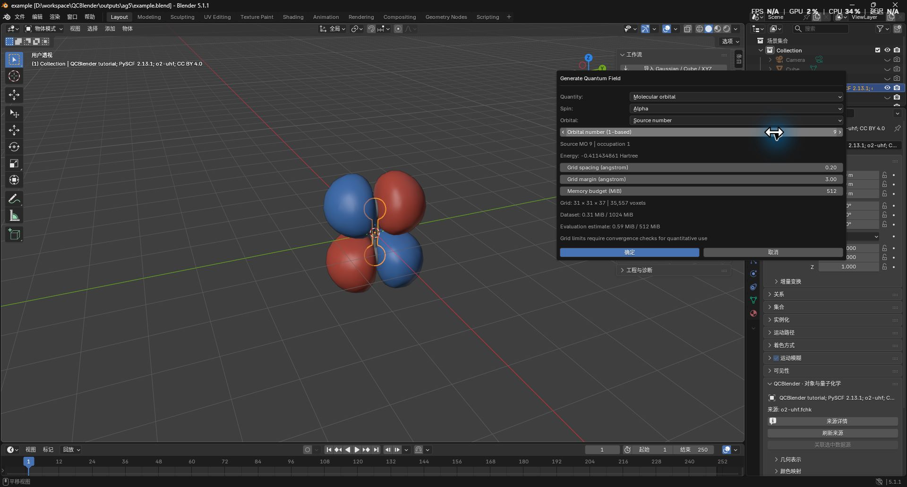
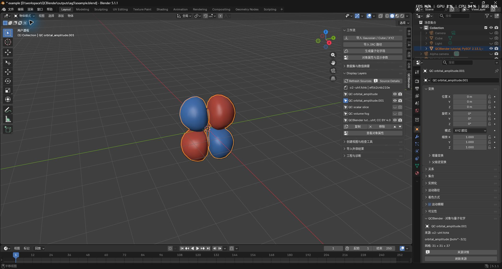
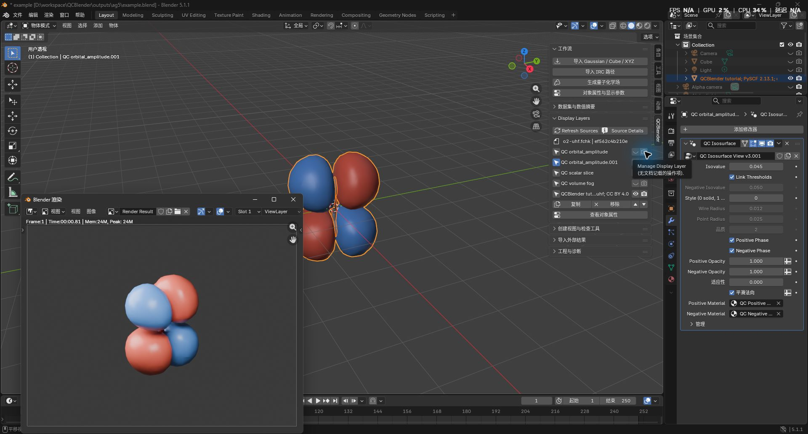
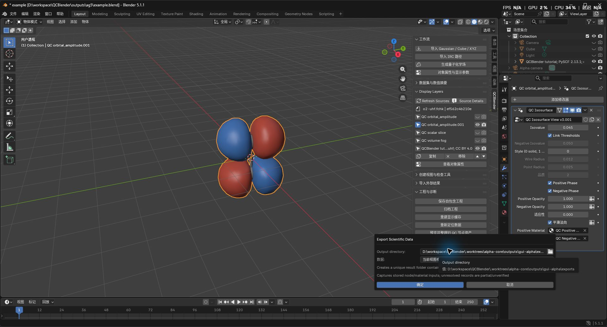
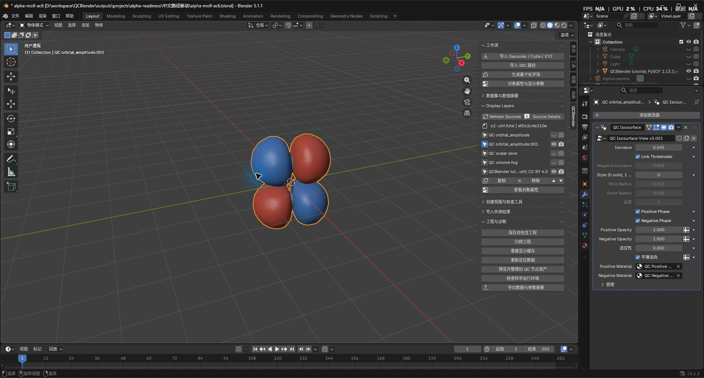

# GitHub Alpha 本地技术验证

2026-10-05，Windows x64 / Blender 5.1.1；基线 `main@9bfa682`，固定产品提交 `19e4cf0becf5a5173d692d1f4a9c621e6d01512e`。本轮完成资源边界、科学缓存身份、异步科学预检、实时参数摘要、公开候选 CI 和草稿发布流程。完整身份、检查状态与截图摘要见[机器索引](alpha-readiness-validation.json)，文件位置由[ARTIFACTS](../ARTIFACTS.md)统一维护。

候选 `qcblender-0.1.0.zip`：50,656,085 字节，SHA-256 `0c2d9add59b6332f243c5cd87b852a38b94090286f1b7671d7666694a4b73a03`。产品树 `5db4996cbb456f52529c86219d85f0db0541ae49`。本地候选 run ID 为 **0**，没有 GitHub artifact ID，不能作为远端发布资格。后续 GitHub CI 必须对实际远端提交重新生成证据；发布阶段仅上传该次候选的原文件。

| 验证范围 | 状态 | 证据与边界 |
| --- | --- | --- |
| 显式标准库集合 | Passed | 127 项，0 failure/error/skip；包含资源、资格交接、取消、摘要和发布身份负例 |
| 公开科学集合 | Passed | 67 项，0 skip；真实 IOData/GBasis 与独立 cubegen/Fortran 对照 |
| 完整本地科学回归 | Passed | 123 项，0 skip；受限输入仅用于本地验证，不加入公开附件 |
| 同批构建、离线安装、注册/注销 | Passed | 原始候选、安装源码、锁及资格报告绑定一致 |
| 原地及中文路径冷重开 | Passed | 自动候选和实际界面工程分别保存报告；实际工程 59 文件摘要不变，三个 Dataset 读回 |
| 六固定视觉场景 | Passed | atoms、signed-mo、density-esp、slice-contours、fog、legend-annotations；新建和冷重开共 12 次，原图与差异图保留 |
| 原生 GUI | Passed | Agent Computer Use 确认预检交接、MO9 生成、取消、菜单 Undo/Redo、等值修改、渲染、摘要、自包含保存及移动重开 |
| Standards / Spec | Passed / Passed | 两个独立只读复审，固定基线至最终产品提交，0 遗留问题 |
| 实际 GitHub CI、草稿与发布后下载复核 | Not Run | 远端写入待明确授权 |
| 组件许可复核 | Not Run | IOData/GBasis 元数据与 LICENSE 声明差异尚需处理依据 |
| 独立使用者短 SOP 与维护者公开批准 | Not Run | 由使用者和维护者填写；Agent 不代签 |
| 正式 v1 人工与科研验收 | Not Run | 保留完整 C01–C13 / N01–N18 门禁 |

## 实际界面证据

界面检查使用候选安装副本和公开复现工程。安装与原始 P01 导入由命令行完成，活动对象和只读状态记录由启动脚本准备；以下按钮、菜单与参数输入由 Agent Computer Use 实际执行。此记录不代表独立用户完成干净配置安装及整条 SOP。

P01 为 UHF/STO-3G，源 SHA-256 `ef562c4b210e7c380219282d7684370cca1f0e8349dffa1d4388af5831472e36`。选 P01 原子视图，点击 **3D Viewport → N → QCBlender → 工作流 → 生成量子化学场**，首次异步预检后打开对话框。取消尚未启动作业的对话框正常结束，资格记录保留，worker 数为零。重新打开后选 **Molecular orbital / Alpha / Source number / 9**，使用 **0.2 Å / margin 3 Å / 512 MiB**；显示 **31 × 31 × 37、35,557 体素、Dataset 0.31 MiB、求值估算 0.59 MiB**。

生成后选中 `QC orbital_amplitude.001`。点击 **Edit → Undo**，新场及其源对象消失；点击 **Edit → Redo**，完整恢复。观察器记录没有残留作业或 Dataset 错误。

选新场，在 **Properties → Modifiers → QC Isosurface** 将 **Isovalue** 改为 **0.045 bohr^-3/2**，保留 **Link Thresholds**。公开复现工程已包含原场，因此在 **Display Layers** 关闭原场的视口与渲染可见性，再按 **F12**。渲染正常完成。

选新场，点击 **N → QCBlender → 工程与诊断 → 导出数据与参数摘要**，Data 保持 **当前视图参数摘要**。导出的 Markdown 与 JSON 记录实时 0.045、Alpha MO9、网格、方法、单位、有效域及材质。冷重开后再次导出产生独立目录，科学元数据与显示参数一致；取消导出没有新增目录。内部节点组与渲染求值不在摘要的核验范围内，`partial/unverified` 说明保留。

点击 **保存自包含工程**，另存 `alpha-mo9-ac6.blend`，确认匹配 `alpha-mo9-ac6.qcdata/`，工程无未保存状态。正常退出 PID 95032 后迁入 `outputs/projects/alpha-readiness/中文路径移动/`，59 个文件逐一核对 SHA-256；新 PID 9808 打开移动后的工程，表面为 944 顶点 / 936 面、等值 0.045，三个 Dataset 成功读回，资格记录为零。再次导出成功后正常退出，保存文件字节不变。

原生日志仍包含已有切片对象的 Blender VFont relation warning，以及首次退出时 525 个共约 0.038 MiB 的 memory-block 提示；当前候选没有生成取消的 Python 异常。这些日志保留在本批证据中。

## 缺陷与修补记录

历史失败与通过报告均按原始字节保留。ac2/ac3 的重做问题、ac4 的 RNA 成员检查错误、ac5 的尚未创建 `_job` 时取消错误均有独立记录；最终 ac6 重新确认异步交接、取消和菜单 Undo/Redo 通过。最终候选的原生上下文检查同时保留在 fresh 和 reopen 报告中。历史报告的 Passed 不自动绑定新候选。

## 发布门禁

发布研究由独立 subagent 完成，参考 MolecularNodes 草稿流程、ChemBlender 精确标签/artifact 核验与 BlenderKit 阶段交接，见[研究与来源](../research/github-release-workflow.md)。默认分支手动发布，输入 `tag`、`candidate_run_id`、`dry_run`；默认仅验证。公开附件排除 P02。artifact 过期、标签/提交/版本/摘要不一致、报告或许可证据缺失均停止；重复附件核对原摘要，不覆盖公开内容。

维护者完成组件许可复核和独立短 SOP 试装后，明确批准并在 GitHub UI 将草稿公开为 prerelease。首次 Alpha 的门禁与正式 `v1.0.0` 完整验收分别维护。
