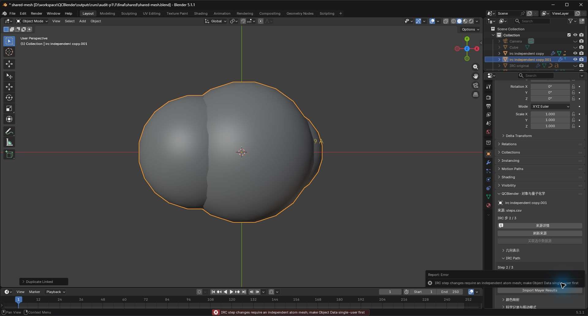
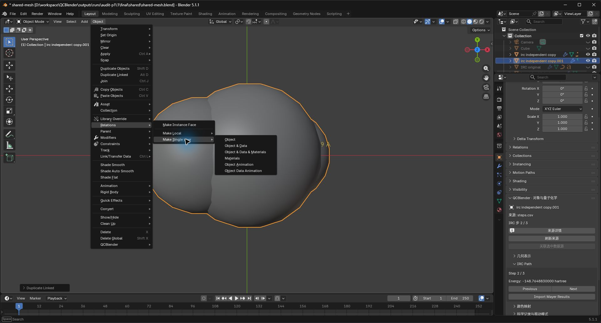
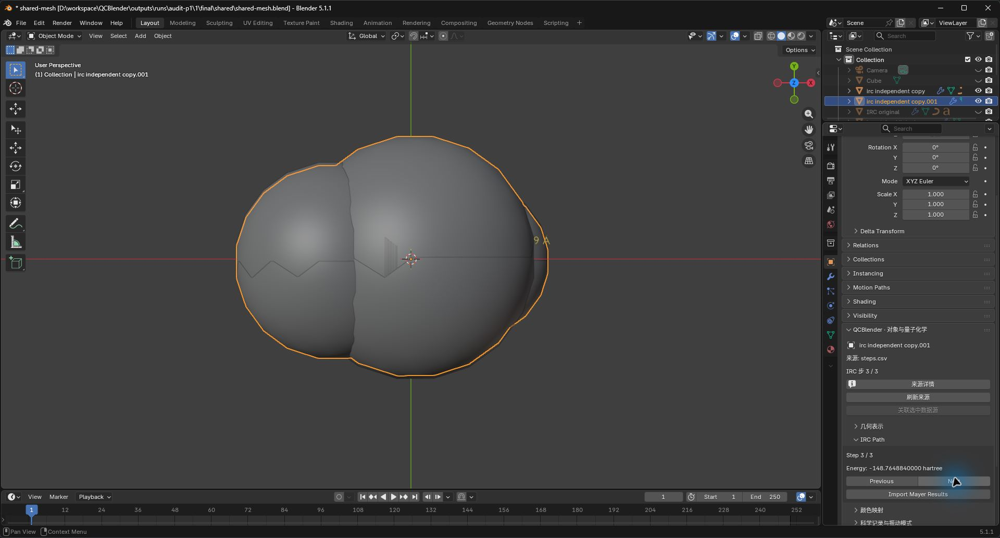
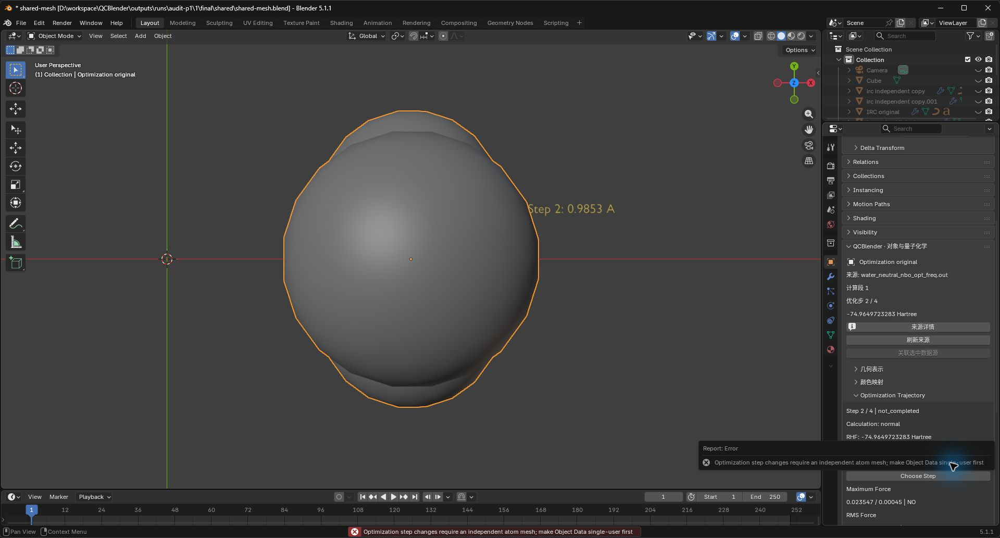
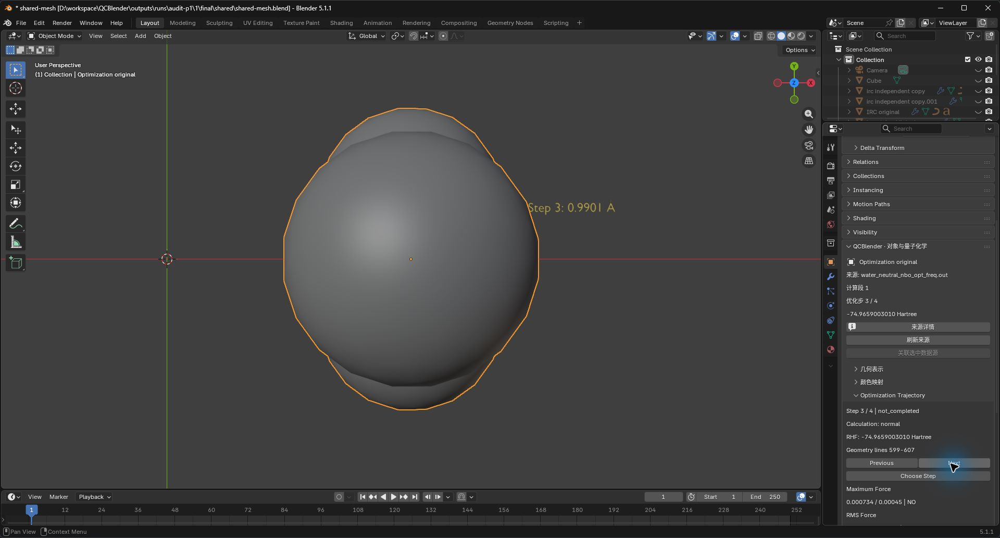
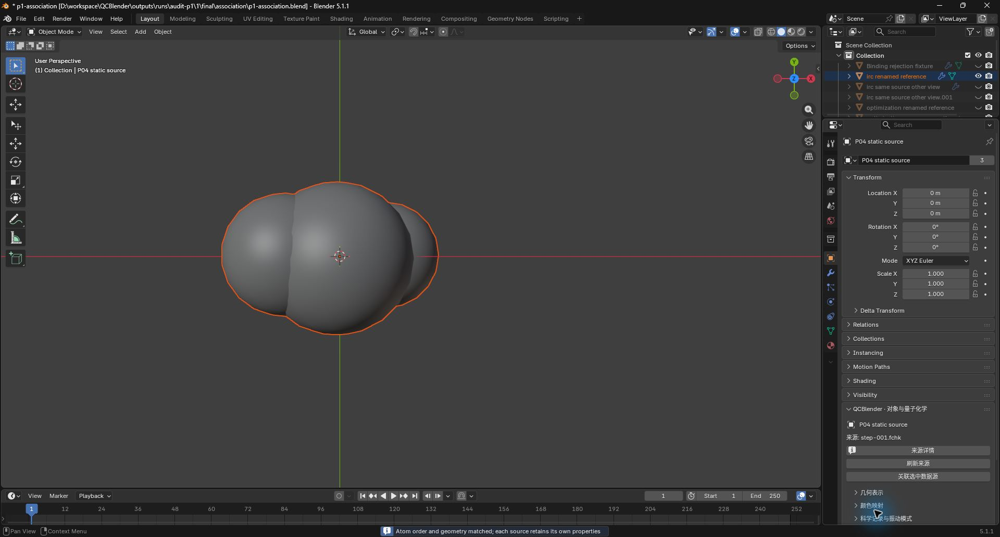
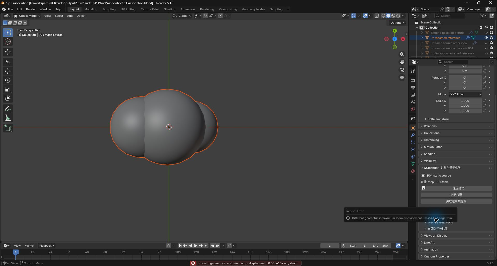
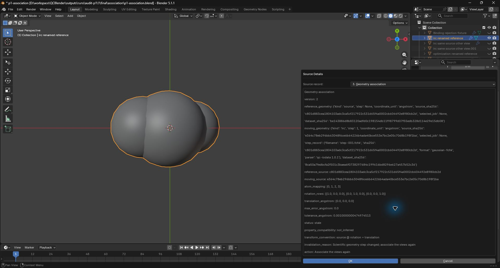
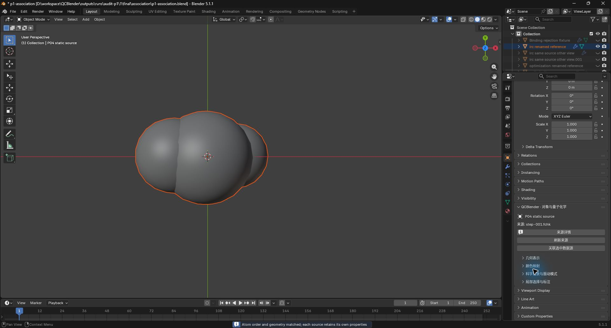

# 当前构型关联与共享 mesh 切步验证

2026-10-04，AUDIT-01 与 AUDIT-04 技术验证 **Passed**。IRC/优化关联使用双方当前步骤的源 Å 坐标，并记录具体参考对象和科学身份。任一端换步后关联失效；共享原子 mesh 在写入前拒绝换步，先使 Object Data 单用户后才能继续。

候选固定产品源码 `a4baaaf2cf163d93d8d7e25f3c9bd5e96ae01c3d`，产品树 `c1a5bc48b035434c4a3245909e1e629bec4f0665`。精确 ZIP、报告摘要和保全工程由[机器索引](audit-p1-validation.json)及 [ARTIFACTS](../ARTIFACTS.md)定位。独立用户复做及科研签署 **Not Run**。

| 检查 | 状态及范围 |
| --- | --- |
| 科学回归 | Passed，97项，零失败、错误、跳过 |
| 当前构型关联 | Passed，真实P04 IRC及P02优化；双方角色、同/异步、对象重命名/删除/复制、同源不同对象、旧记录、损坏记录、原子身份、切片/着色消费端 |
| 共享 mesh | Passed，原生 linked duplicate；IRC根/子入口、优化NEXT/PREV/GOTO、XYZ拒绝对照；拒绝时双方完整状态及数组不变，独立后成功且原件不变 |
| 固定视觉 | Passed，atoms、signed-mo、density-esp、slice-contours、fog、legend-annotations六场景与既有基准比较 |
| 实际界面 | Passed，关联、失效提示、重新关联；IRC/优化共享拒绝与单用户后换步；实际Undo/Redo并逐状态核对 |
| 保存与冷重开 | Passed，原生场景原地/中文移动冷读；两个GUI工程分别关闭后以新进程读回 |
| Standards / Spec评审 | 各发现1项P2，均修复复审通过，0项阻断遗留；重复转换优化为非阻断建议 |

全部原始成功与失败报告保留在本批证据目录。早期基线缺陷、验收脚本目录复用/类型诊断及旧候选损坏记录回归失败保留原状态；当前通过证据取自 `final/`、`install-qualified-v2/` 和新候选资格索引。GUI中的默认0.001 Å容差由Blender FloatProperty保存为约0.0010000000475 Å。

## 原生入口复做

以下图片来自Agent Computer Use实际操作；MCP用于准备对象/选择、逐值核对和复用保存入口。每步均应由使用者另行记录自己的结果和截图。

1. 导入P04 IRC后，选中IRC原子根对象，用Blender原生 **Alt+D** 建立链接副本并取消位移。仅选中副本，在 **Properties → Object → QCBlender → IRC Path → Next** 点击下一步。应提示先使Object Data单用户，双方构型、步骤和标注保持不变。

2. 保持仅选副本，在3D视图使用 **Object → Relations → Make Single User → Object & Data**。再回到 **IRC Path → Next**；副本换步，原件保持原步。实际验证还覆盖此单用户操作及换步的Undo/Redo。

3. 对P02优化轨迹根对象建立原生链接副本。在 **Properties → Object → QCBlender → Optimization Trajectory → Next** 检查相同拒绝。使副本Object Data单用户后，再点击Next；原件不变，副本标注随步骤更新。单用户入口在步骤2实际点击确认，本步通过MCP复用；拒绝、Next、Undo/Redo由Computer Use实际执行。

4. 将P04 IRC置于第1步，同时选中IRC对象和单独导入的 `step-001.fchk` 原子对象，最后选FCHK对象作为活动参考。在 **Properties → Object → QCBlender → 关联选中数据源**，保留0.001 Å容差并确认，应成功。

5. 仅选IRC对象，在 **IRC Path → Next** 切到第2步；再次按步骤4选择两个对象并执行关联。应报告最大偏差约0.0354167 Å并拒绝，拒绝前后的科学及显示状态完全一致。第3步对第1步的0.0707267 Å拒绝另由原生脚本验证。

6. 仅选IRC对象，返回第1步。在 **Properties → Object → QCBlender → 来源详情 → Source record → Geometry association** 查看 `status: stale` 和 `Associate the views again`。切回原步不自动恢复有效性；显示位置保持。旧版关联也需重新建立。

7. 按步骤4重新关联，状态恢复有效。换步的Undo恢复原关联，Redo再次使其失效；这些状态已逐对象、构型、矩阵、指针及科学数组核对。插件复制层或创建当前版本视图后，需要为新对象重新关联。

8. 使用 **N侧栏 → QCBlender → 工程与诊断 → 保存自包含工程**；一起保留同名 `.blend + .qcdata/`。关闭后重新打开，检查当前步骤、关联参考对象与状态。GUI保全工程在 `outputs/projects/audit-p1/gui/`。

用户复做：**Not Run**；独立科研签署：**Not Run**。
