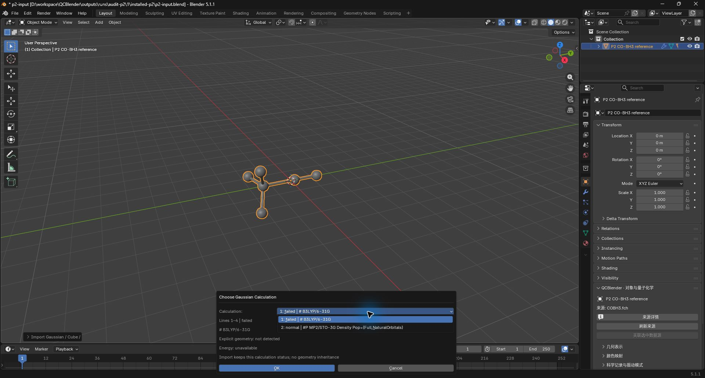
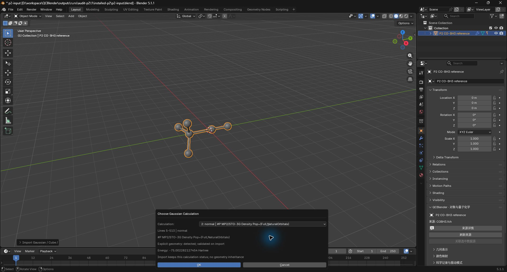
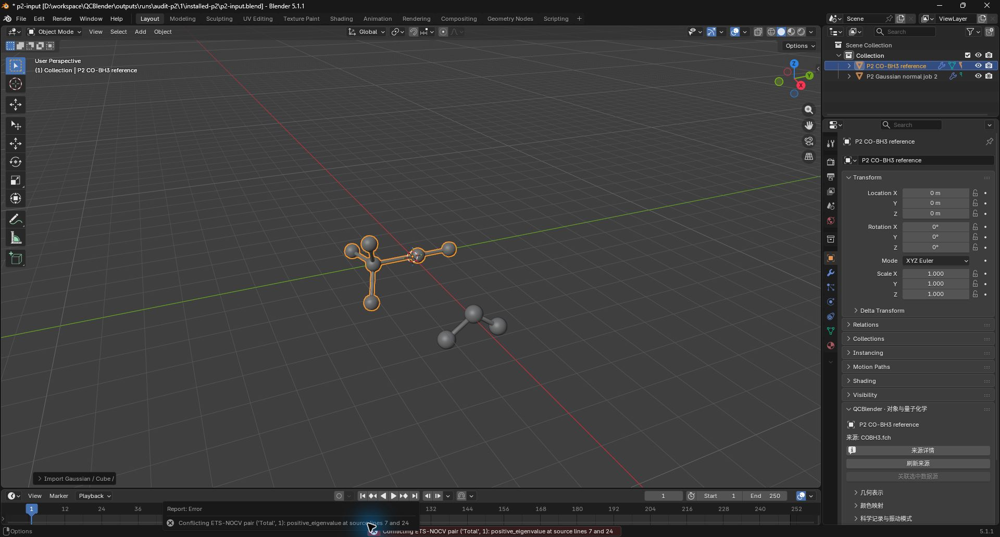
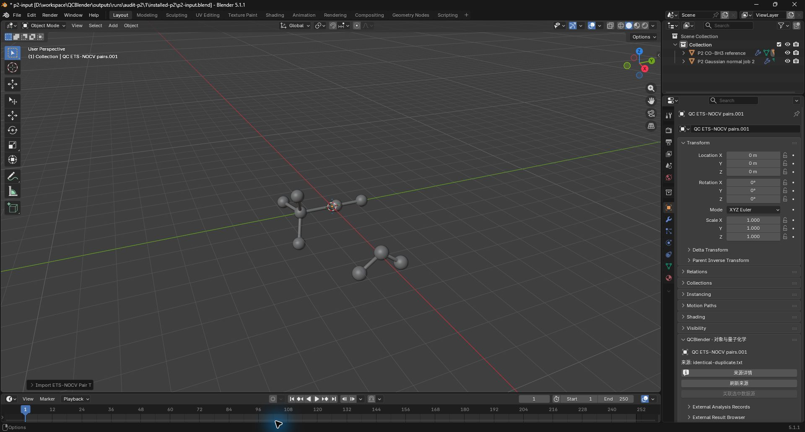

# 两项 P2 与固定基准验证

2026-10-04，本批技术验证 **Passed**。Gaussian 首任务在 SCF 前失败后，后续正常任务能独立选段导入；ETS-NOCV 同 spin/pair 的重复记录比较全部规范化科学字段，相同记录保留首次来源，冲突明确给出字段和两条来源行号。

候选、产品树和摘要见[机器索引](audit-p2-baselines-validation.json)，工程、原始报告、命令和迁移映射统一见 [ARTIFACTS](../ARTIFACTS.md)。两个范围外 P1（动态构型关联、共享 mesh 副本切步）仍未修复。独立用户/科研签署为 **Not Run**。

| 检查 | 结果 |
| --- | --- |
| 科学回归 | Passed，91项，零跳过 |
| 基准单测 | Passed，17项 |
| 固定视觉 | Passed，六场景各3次新进程运行、各1次冷重开；4项受控像素变更均检出 |
| 场与显示性能 | Passed，各组预热1次、正式5次；速度仅报告 |
| 原生导入、Computer Use确认、保存后冷重开 | Passed |
| Standards评审 | 发现1项，修复复审通过，0遗留 |
| Spec评审 | 发现1项，修复复审通过，0遗留 |

基准环境为 Blender 5.1.1 / Cycles CPU / i5-13600KF。场求值64³、128³、256³冷运行中位数分别为2.533、6.375、36.807秒；热缓存为1.471、1.673、3.091秒。1、8、32视图阈值更新中位数分别为1.932、3.608、8.818毫秒，终点为依赖图更新完成。原始五次测量、进程峰值内存及身份保存在`performance-fields/report.json`和`performance-display-v2/report.json`；这些结果不表示视口FPS。

复跑命令、阈值、环境匹配和参考图审查方式见[基准说明](visual-performance-baselines.md)。早期缺失fixture、过低灵敏度ROI和空MO显示诊断保留原Failed/Running报告；最终结果分别由`science-complete.json`、`visual-suite-v2.json`、`performance-display-v2/report.json`给出，未改写失败历史。

## 原生入口复做

本批对话框由MCP准备，文件确认、选段和导入确认由Agent Computer Use执行，结果由MCP读取并与原始数组核对。以下图片为实际窗口，独立用户复做尚未签署。

1. 无须选中对象。在3D视图的 **N侧栏 → QCBlender → 工作流 → 导入 Gaussian / Cube / XYZ** 打开本批`installed-p2/sources/`中的拼接日志。文件确认后展开任务列表，第一段失败、第二段正常；选择失败段并确认会报告缺少显式构型。

2. 选择第二个正常任务，核对摘要中的MP2/STO-3G、3原子和能量，点击 **确定**。导入后全部科学数组与单独正常日志一致。

3. 仅选中CO-BH3参考对象。在 **N侧栏 → QCBlender → 导入外部结果 → ETS-NOCV 表** 打开`positive_eigenvalue.txt`，点击 **确定**。错误提示应包含`positive_eigenvalue`及来源行7、24；已有对象和数组保持不变。

4. 保持CO-BH3参考对象为活动对象，同一入口打开`identical-duplicate.txt`并确认，表中保留9对及首次来源。保全工程为`outputs/projects/audit-p2/gui/p2-verified.blend`，新进程冷重开已逐数组核对。

用户复做：**Not Run**；独立科研签署：**Not Run**。
