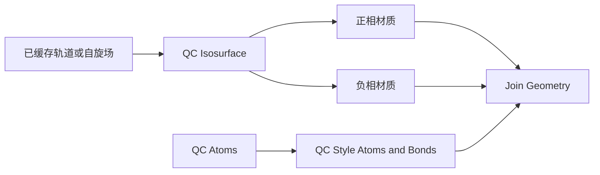
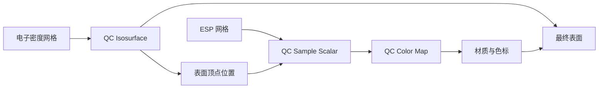

# 几何节点接口与科学显示契约

状态：首版配方契约；实现进展与具体边界见 [验收记录](../VALIDATION.md)。数据约定见 [通用 QC 数据契约](qc-data-contract.md)。节点操作已导入数据，文件读取、波函数求值和缓存构建由独立的插件操作执行。

## 1. 分组方式

迁移 MolecularNodes 的组合方式：**数据读取 → 选择 → 样式 → 着色 → 动画/标注组合**。其中动画在原子数据上更新位置，再由样式节点生成球棍。

节点组公开 Blender 已支持的 Geometry、Object、Collection、数值、布尔、颜色、材质及实际网格 socket；完整的 QC 数据对象留在插件数据层，不创建一个假想的 Python 对象 socket。

为区分界面、节点和计算，采用以下约定：

- 侧栏选择计算、构型、轨道和模式，定位已导入的 data ID。
- 选择未缓存的场时，显示缺失原因和明确的“导入/生成场”操作，不在节点求值中读取源文件。
- 节点控制阈值、选择、尺度、材质和已载入数据之间的组合；侧栏快捷控件绑定同一个 socket，避免状态重复。
- 物理量、轨道编号、自旋、单位和关联几何由数据引用决定，不因改 Blender 对象名而改变。

## 2. 原子和向量属性

原子载体为点/边几何。下列属性中除 `qc_fragment_id` 尚未交付外，均由当前视图写入；节点组合必须保留稳定原子身份。

| 属性 | 域/类型 | 含义 |
| --- | --- | --- |
| `qc_atom_id` | POINT / INT | 稳定原子编号，索引变化时仍可映射 |
| `qc_atomic_number` | POINT / INT | 元素编号；幽灵/虚拟中心需显式分类 |
| `qc_fragment_id` | POINT / INT | 用户确认的片段标签 |
| `qc_charge` + `qc_charge_valid` | POINT / FLOAT + BOOLEAN | 当前选定布居方法的电荷与有效标志；方法记录在数据绑定中 |
| `qc_mode_displacement` | POINT / VECTOR | 当前模式位移，经导入层统一约定 |
| `qc_equilibrium_position` | POINT / VECTOR | 模式对应的平衡构型 |
| `qc_bond_source` | EDGE / INT | 文件提供、用户定义或距离推断 |
| `qc_scalar_value` + `qc_sample_valid` | POINT / FLOAT + BOOLEAN | 表面/切片的物理采样值与范围有效性 |

缺失值不借用数值零表示。并排展示两种电荷方法使用独立 ViewBinding，保持各自方法标签和范围。

## 3. 节点清单与 socket 契约

下表是配方职责与目标 socket 契约，不是已发布的独立公共节点名称清单。当前原子选择、样式和振动组合到每个原子视图的节点组；场提面/映射、切片、偶极及 IR 使用各自的可编辑节点组。实际 socket 以修改器和侧栏为准，片段选择等未交付能力不计入已支持范围。最后一列描述可观察行为。

| 节点组 | 主要输入 | 输出 | 约束/行为 |
| --- | --- | --- | --- |
| `QC Atoms` | 数据 Object、构型引用 | Geometry | 取得带属性原子点与键，不生成球；配置在数据绑定中 |
| `QC Select Atoms` | Geometry、元素/编号/片段/属性范围 | Boolean Selection | 组合使用原生 Boolean Math；无效属性不选中 |
| `QC Style Atoms and Bonds` | Geometry、Selection、原子/键半径、质量、Material | Geometry | 原子和键风格共享选择；键连接两端随原子位置更新 |
| `QC Scalar Field` | Volume Object、Grid Name | 实际体/网格接口 | 选择一个有明确身份的已加载 dataset，不解释所有网格为 density |
| `QC Orbital` | 已缓存的轨道场 Object、通道/编号绑定 | 同 Scalar Field | 作为轨道工作流入口；HOMO/LUMO 解析由元数据选择器完成 |
| `QC Isosurface` | Grid、正阈值、双相开关、各相可见/Material、Adaptivity | Geometry | 默认 ±同一绝对值；分别开关相位；默认 Adaptivity=0 |
| `QC Sample Scalar` | Grid、Position、Interpolation、采样域信息 | Value、Valid | 明确坐标变换；默认三线性；范围外不给物理零值解释 |
| `QC Color Map` | Value、Valid、Min/Max、Center、Color Ramp | Color | 数值不改写；固定图例范围；越界/缺失有专用显示 |
| `QC Slice` | Grid、中心/法向、平面大小、采样数 | Geometry + sampled attrs | 平面采样；样本分辨率独立于源网格；等高线是可组合样式 |
| `QC Vector Glyphs` | Points、Vectors、Selection、比例、归一化、长度上限、Material | Geometry | 同一资产服务偶极/位移；归一化仅影响显示，原向量保留 |
| `QC Animate Normal Mode` | Atoms、Displacement、Amplitude、Phase、Playback Rate | Geometry | 更新原子位置后生成样式，原始频率标签不随播放速度变化 |
| `QC Animate Frames` | 已载入帧、步号、插值设置 | Geometry | 已列入后续轨迹阶段；插值是显示中间构型，不能伪造已计算性质 |

质量输入控制球体细分或曲线截面，不改变科学场值。`QC Orbital` 的语义输入通过已存在的数据对象/属性实现；资产构建时要按锁定 Blender 版本确认真实 socket 类型，不能把概念列名直接当 Python API。

## 4. 四种主要配方

体积雾配方使用 `QC Style Volume Fog v1`，输入为 Volume 和 Material，输出仍是体积几何，可与表面分支组合。材质通过 `qc_value` 和 `qc_valid` 采样：有符号量的不透明度为 `scale * abs(value)`，电子数密度为 `scale * max(value, 0)`，仅在有效域显示。scale 是光学显示参数，不代表电子数密度转换，也不把轨道振幅改写为概率密度。默认颜色仅区分正负，原始场和单位不变；侧栏与材质节点共用不透明度和颜色参数。

Blender 5.1 的 [Set Material](https://docs.blender.org/manual/en/5.1/modeling/geometry_nodes/geometry/material/set_material.html) 支持体积几何；[体积材质](https://docs.blender.org/manual/en/5.1/render/materials/components/volume.html) 可通过 Attribute 节点读取命名网格。空间采样范围过小会截断体积云；提高显示不透明度不能替代网格范围收敛。

### 轨道/自旋双相等值面

科学参数为轨道类型、源编号、自旋、几何、等值及其单位；显示参数为两侧材质和可见性。采用 `f` 和派生缓存 `-f` 在正阈值提面，保存原始 signed field。颜色表示相位/符号，不表示正负电荷。HOMO/LUMO 使用实际占据及通道判断；NTO、自然轨道不能直接套 canonical orbital 的能级标签。

### 密度表面映射 ESP

两个场各有来源、单位、原点和步向量。选表面阈值不会改变色标；Min/Max、中心值和图例使用同一参数来源。跨分子比较时默认保留用户锁定范围，自动范围必须显式选择并记录。

有效性判断在场的索引空间进行。对于三线性插值，只有采样所需邻点处于已知域才标为有效；斜轴场不能只用世界空间轴对齐包围盒判断。有效域外单独着色/隐藏并给数量诊断，不能让 VDB 默认背景零伪装成真实零势。

### 振动与 IR 选择联动

IR 棒状谱/模式表选择是 UI 行为，切换后只更新当前位移属性和标签；节点负责连续相位。模式位移不重复做质量加权；虚频的往复显示明确为模式示意。电子场保持对应构型的静态数据，除非另有逐构型计算。

### 电荷与偶极

电荷属性经 `QC Color Map` 进入原子材质，图例保留布居方法。偶极向量经 `QC Vector Glyphs` 生成箭头，物理单位 Debye 等由数据层记录；箭头长度比例只负责显示。净电荷体系保存偶极的原点约定。

## 5. 科学默认值和资产生命周期

等值面默认关闭几何平滑、重网格、删除小连通分量和自适应简化；可开启法线平滑。形状处理若启用，保留原始分支并标记为展示处理。裁切 ROI 仅表示看见哪些空间区域，不改变场定义。

节点组保留稳定 socket 标识和资产版本；升级创建新版本，不覆盖用户已改的树。用户可拆开配方继续组合，侧栏失去可靠绑定时提示恢复/重绑，不自动重建并抹掉改动。删除视图只有在无人引用时才清理对应派生缓存，科学数据管理有独立操作。

发布图注应能取得：物理量/方法/构型、自旋和轨道、阈值与单位、色标范围、插值、几何处理、振动模式/显示振幅。相机、灯光与材质作为展示参数保存。

## 6. 当前实验与未验证项

[probe_volume_nodes.py](../../tools/probe_volume_nodes.py) 已在 Blender 5.1.1 实际通过：有符号非对称场、斜轴/平移变换、正负面、阈值变更和第二个斜轴标量场的三线性采样。第二场采用解析线性函数，在所有提取表面顶点比较，最大绝对误差约 `1.79e-6`，检查阈值为 `1e-5`。

该实验包含 `Get Named Grid → Grid to Mesh → Sample Grid → Store Named Attribute`，只证明数值和几何路径；尚未验证完整资产库、科学输入、材质/色标渲染、范围外处理、GUI、动画和冷重开。其数据不是实际 Gaussian ESP。
