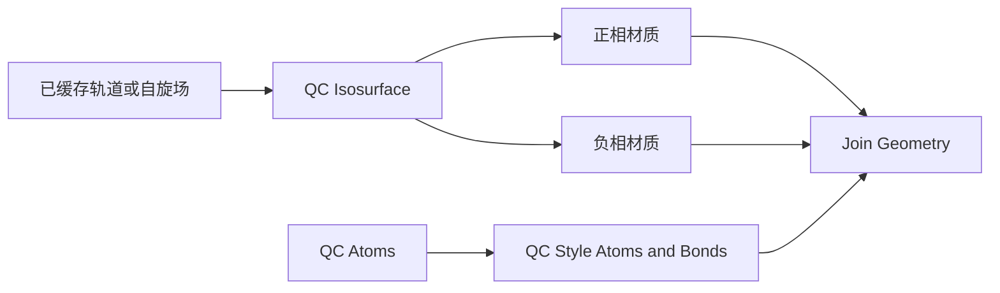
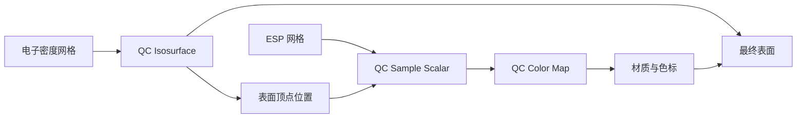
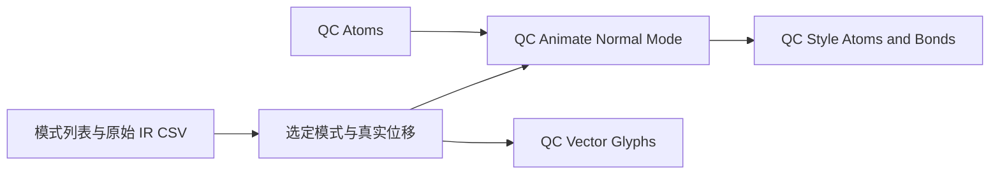

# 几何节点接口与科学显示契约

当前节点与科学显示契约；实现和验证边界见 [验收记录](../VALIDATION.md)。数据约定见 [通用 QC 数据契约](qc-data-contract.md)。节点操作已导入数据，文件读取、波函数求值和缓存构建由独立的插件操作执行。

## 1. 分组方式

迁移 MolecularNodes 的组合方式：**数据读取 → 选择 → 样式 → 着色 → 动画/标注组合**。其中动画在原子数据上更新位置，再由样式节点生成球棍。

节点组公开 Blender 已支持的 Geometry、Object、Collection、数值、布尔、颜色、材质及实际网格 socket；完整的 QC 数据对象留在插件数据层，不创建一个假想的 Python 对象 socket。

为区分界面、节点和计算，采用以下约定：

- 侧栏选择计算、构型、轨道和模式，定位已导入的 data ID。
- 选择未缓存的场时，显示缺失原因和明确的“导入/生成场”操作，不在节点求值中读取源文件。
- 节点控制阈值、选择、尺度、材质和已载入数据之间的组合；对象属性快捷控件绑定同一个 socket，避免状态重复。
- 物理量、轨道编号、自旋、单位和关联几何由数据引用决定，不因改 Blender 对象名而改变。

Display Layers 面板管理当前场景的原子、表面、切片、体积雾、偶极和兼容旧工程的 IR 对象。可新增表面/雾/切片、重命名、复制、删除、排序，并分别控制视口和渲染可见性。选中层后，对象/材质属性编辑该层的节点或材质输入。复制创建独立网格、外层节点组和材质；通用样式资产与只读科学场继续共享。振动层另复制 IR 对象，模式高亮互不影响。删除显示层保留其子层的世界变换和科学数据文件。排序只控制面板组织，不改变三维深度遮挡。

## 2. 原子和向量属性

原子载体为点/边几何。下列属性按视图类型与可用数据写入；节点组合必须保留稳定原子身份。

| 属性 | 域/类型 | 含义 |
| --- | --- | --- |
| `qc_atom_id` | POINT / INT | 源原子零起始索引；界面源编号从 1 开始 |
| `qc_atomic_number` | POINT / INT | 元素编号；幽灵/虚拟中心需显式分类 |
| `qc_charge` + `qc_charge_valid` | POINT / FLOAT + BOOLEAN | 当前选定布居方法的电荷与有效标志；方法记录在数据绑定中 |
| `qc_mode_displacement` | POINT / VECTOR | 当前模式位移，经导入层统一约定 |
| `qc_equilibrium_position` | POINT / VECTOR | 模式对应的平衡构型 |
| `qc_bond_source` | EDGE / INT | 文件提供、用户定义或距离推断 |
| `qc_scalar_value` + `qc_sample_valid` | POINT / FLOAT + BOOLEAN | 表面/切片的物理采样值与范围有效性 |

缺失值不借用数值零表示。并排展示两种电荷方法使用独立 ViewBinding，保持各自方法标签和范围。

## 3. 节点清单与 socket 契约

九个公共资产由 `qcblender/asset_catalog.py` 固定身份，工厂位于 `blender/assets.py`。此表列主要输入；全部 socket 标识、默认值和连接以对应工厂为准，不通过改名升级已保存工程。

| 稳定资产 ID | 工厂 | 主要职责 |
| --- | --- | --- |
| `qc.sample.v1` | `sample_group` | Volume/坐标变换、标量与有效域采样 |
| `qc.atom_selection.v1` | `selection_group` | 元素和源编号范围的 Boolean Selection |
| `qc.atom_style.v1` | `atom_style_group` | 原子/键几何、选择、半径、材质和显示样式 |
| `qc.surface_style.v1` | `surface_style_group` | 实体、线框、表面顶点球及材质 |
| `qc.isosurface.v3` | `isosurface_group` | 正负等值、相位显隐/材质、法线；输出 Geometry 与独立 Positive/Negative |
| `qc.volume_fog.v1` | `fog_group` | 体积几何与 Material |
| `qc.color_scalar.v2` | `color_group` | Value/Valid、Minimum/Center/Maximum、颜色映射 |
| `qc.slice.v1` | `slice_group` | 平面尺寸/分辨率及空间变换 |
| `qc.clip.v1` | `clip_group` | 局部平面/包围盒裁剪 |

库内资产不绑定具体对象/材质，工程内外层节点负责 Dataset 绑定。模式、偶极和 IR 由对应视图组合原生节点，不是额外公共资产。质量参数控制显示几何，不改变科学数组。

## 4. 四种主要配方

以下流程图使用职责名称描述组合关系，不是 Python API 或额外资产名称。

体积雾配方使用 `QC Style Volume Fog v1`，输入为 Volume 和 Material，输出仍是体积几何，可与表面分支组合。材质通过 `qc_value` 和 `qc_valid` 采样：有符号量的不透明度为 `scale * abs(value)`，电子数密度为 `scale * max(value, 0)`，仅在有效域显示。scale 是光学显示参数，不代表电子数密度转换，也不把轨道振幅改写为概率密度。默认颜色仅区分正负，原始场和单位不变；侧栏与材质节点共用不透明度和颜色参数。

Blender 5.1 的 [Set Material](https://docs.blender.org/manual/en/5.1/modeling/geometry_nodes/geometry/material/set_material.html) 支持体积几何；[体积材质](https://docs.blender.org/manual/en/5.1/render/materials/components/volume.html) 可通过 Attribute 节点读取命名网格。空间采样范围过小会截断体积云；提高显示不透明度不能替代网格范围收敛。

### 轨道/自旋双相等值面

科学参数为轨道类型、源编号、自旋、几何、等值及其单位；显示参数为两侧材质和可见性。采用 `f` 和派生缓存 `-f` 在正阈值提面，保存原始 signed field。颜色表示相位/符号，不表示正负电荷。HOMO/LUMO 使用实际占据及通道判断；NTO、自然轨道不能直接套 canonical orbital 的能级标签。

### 密度表面映射 ESP

两个场各有来源、单位、原点和步向量。选表面阈值不会改变色标；Min/Max、中心值和图例使用同一参数来源。跨分子比较时默认保留用户锁定范围，自动范围必须显式选择并记录。

有效性判断在场的索引空间进行。对于三线性插值，只有采样所需邻点处于已知域才标为有效；斜轴场不能只用世界空间轴对齐包围盒判断。有效域外单独着色/隐藏并给数量诊断，不能让 VDB 默认背景零伪装成真实零势。

### 振动与 IR 选择联动

当前模式列表选择是 UI 行为，切换后只更新当前位移属性和标签；节点负责连续相位。IR 原始频率与强度通过“导出数据与参数摘要”的 IR 选项导出 CSV；当前入口不新建棒状谱。旧工程 IR 对象按兼容数据保留。模式位移不重复做质量加权；虚频的往复显示明确为模式示意。电子场保持对应构型的静态数据，除非另有逐构型计算。

### 电荷与偶极

电荷属性经 `QC Color Map` 进入原子材质，图例保留布居方法。偶极向量经 `QC Vector Glyphs` 生成箭头，物理单位 Debye 等由数据层记录；箭头长度比例只负责显示。净电荷体系保存偶极的原点约定。

## 5. 科学默认值和资产生命周期

等值面默认关闭几何平滑、重网格、删除小连通分量和自适应简化；可开启法线平滑。形状处理若启用，保留原始分支并标记为展示处理。裁切 ROI 仅表示看见哪些空间区域，不改变场定义。

节点组保留稳定 socket 标识和资产版本；升级创建新版本，不覆盖用户已改的树。用户可拆开配方继续组合，侧栏失去可靠绑定时提示恢复/重绑，不自动重建并抹掉改动。删除显示层不删除科学数据文件；缓存清理遵循工程保存及存储维护规则。

发布图注应能取得：物理量/方法/构型、自旋和轨道、阈值与单位、色标范围、插值、几何处理、振动模式/显示振幅。相机、灯光与材质作为展示参数保存。

## 6. 可组合视图操作

新建视图使用共享公共节点与独立实例包装层。原子选择、原子样式、等值面、表面表现、标量采样、标量颜色映射、平面切片和裁剪均为独立资产。等值面除合并 Geometry 外另提供 Positive / Negative 输出，可各自连接后续分支。使用 Blender 原生 Join Geometry 组合分支，处理次序由连线决定。

- 原子 Style：0 球棍、1 范德华空间填充、2 仅键；表面 Style：0 实体、1 线框、2 表面顶点球。表面点不是电子或概率抽样。
- 正负相位独立显隐、材质颜色与 Opacity；`qc_opacity` 属性保持映射后的相位透明度。Link Thresholds 默认联动 ±Isovalue，关闭后 Negative Isovalue 单独控制负相位幅度阈值。
- Map Colors 将另一个所选场采样到活动表面；生成场不变。数值最小/中心/最大保持用户指定，颜色反转和 Color Ramp 同时作用于表面与图例。
- Fog 材质的 Color Ramp 按数值范围映射；Opacity multiplier 灰度曲线按 `abs(value)/Opacity Range`（非负密度使用 `max(value,0)`）控制光学强度，另有阈值和整体倍率。这些参数不改写源物理量。
- Clip 的平面与范围盒使用显示对象局部埃坐标；平面保留法向量的正侧。表面按网格顶点裁剪，边界精度取决于网格分辨率，不封口；体积在材质采样位置裁剪。
- Read at Cursor 将世界游标转换至源体积局部坐标，对 float64 科学数组三线性插值。界面保留最近取值及坐标，移动游标后须再次点击；无效或越界采样报错。
- New Current-Version View 从相同数据生成标准新版分支，保留旧图及手工改动；匹配的公开参数复制，Fog 使用新版传递材质。显示层 Duplicate 则复制当前图与独立材质。

数据身份、单位和缺失区域必须保持明确。外部 Cube 的 Other scalar 允许用户声明名称及单位，未知单位保持 unknown；该操作不转换数组数值。

## 7. 实验依据（历史专项）

[probe_volume_nodes.py](../../tools/probe_volume_nodes.py) 已在 Blender 5.1.1 实际通过：有符号非对称场、斜轴/平移变换、正负面、阈值变更和第二个斜轴标量场的三线性采样。第二场采用解析线性函数，在所有提取表面顶点比较，最大绝对误差约 `1.79e-6`，检查阈值为 `1e-5`。

该实验包含 `Get Named Grid → Grid to Mesh → Sample Grid → Store Named Attribute`，只证明数值和几何路径；尚未验证完整资产库、科学输入、材质/色标渲染、范围外处理、GUI、动画和冷重开。其数据不是实际 Gaussian ESP。

当前候选的节点行为、资产导出重载、渲染及冷重开范围见 [VALIDATION](../VALIDATION.md)。上述合成场误差是专项实验结论，不代替完整产品验收。

## 当前视图参数摘要

当前视图摘要读取外层修改器实际存储的 socket 值、材质未链接输入、色标节点及可核验的源绑定。缺 socket、链接输入或自定义图不提供默认值；报告记录 partial/unverified 及原因。共享节点资产内部图、灯光和渲染状态的覆盖边界在摘要中明确列出。摘要不改变 Dataset、节点图或材质。
